# jvs框架快速部署


## 部署介绍：


JVS是面向软件开发团队可以快速实现应用的基础开发框架，采用微服务分布式框架，提供丰富的基础功能，集成众多业务引擎，它灵活性强，界面化配置对开发者友好，底层容器化构建，集合持续化构建。

JVS是“软开企服”推出的面向软件开发团队可以快速实现应用的基础开发框架


`安装过程中如出现其它任何问题可联系技术支持群`


### 1.注意事项

1.1 操作系统建议Centos7.6，内存大小16G+

1.2 内存大小请调整.env文件，默认内存大小16G。不建议版本升级直接修改.env文件,可能导致新版本功能无法使用

1.3 部署完成后出现404页面，请重启重启所有docker-compose yml

### 2.环境准备

2.1 安装docker 和docker-compose （如已经安装可以跳过）


```
curl -C- -O --retry 3 https://iptables.cn/file/docker/jvs-docker && chmod a+x jvs-docker && ./jvs-docker -I
```

2.2 安装git


```
yum install -y git
```


2.3 更换yum镜像源


```
yum install -y yum-utils
wget -O /etc/yum.repos.d/CentOS-Base.repo https://repo.huaweicloud.com/repository/conf/CentOS-8-reg.repo
yum update -y
```


### 3.部署项目

3.1 下载项目
```
git clone https://gitee.com/software-minister/jvs-docker-compose.git
```
3.2 替换服务器ip地址
### **必须执行！！！！很重要！！！！** 

请将${ip}修改为本地服务器IP

```
sed -i -e 's/jvs-minio/${ip}/g'  ./mysql/nacos.sql  
sed -i -e 's/file.preview.bctools.cn/${ip}:20812/g'  ./mysql/nacos.sql
sed -i -e 's/documentIpAddress/${ip}/g'  ./mysql/nacos.sql  
sed -i -e 's/documentIpAddress/${ip}/g' ./data/jvs-knowledge-plugins/config.js
```
例: 


sed -i -e 's/jvs-minio/114.114.114.114/g' ./mysql/nacos.sql  
sed -i -e 's/file.preview.bctools.cn/114.114.114.114:20812/g' ./mysql/nacos.sql  
sed -i -e 's/documentIpAddress/114.114.114.114:20812/g' ./mysql/nacos.sql
sed -i -e 's/documentIpAddress/114.114.114.114/g' ./data/jvs-knowledge-plugins/config.js


3.3 部署数据库


```
docker-compose -f docker-compose-db.yml pull
docker-compose -f docker-compose-db.yml up jvs-mysql
```

初始化数据库的时候比较慢和主机性能相关，出现如图


效果就可以 Ctrl+C 退出当前操作；继续下面的操作


```
docker-compose -f docker-compose-db.yml  up -d
docker-compose -f docker-compose-db.yml  up -d createbuckets
```
查看日志是否报错   
`docker-compose -f docker-compose-db.yml logs -f`


3.4 查看nacos


程序依赖nacos 请保证能正常访问nacos后再执行应用部署

```
curl -X GET   'http://127.0.0.1:8848/nacos/v1/cs/configs?dataId=jvs-gateway&group=jvs&tenant=jvs'
```

3.5 启动基础后台框架


```
docker-compose -f docker-compose-base.yml pull
docker-compose -f docker-compose-base.yml up -d
```

查看日志是否报错 

`docker-compose -f docker-compose-base.yml logs -f`


3.6 启动设计服务


```
docker-compose -f docker-compose-design.yml pull
docker-compose -f docker-compose-design.yml up -d
```

查看日志是否报错   
`docker-compose -f docker-compose-design.yml logs -f`


3.7 启动无忧企业文档


```
docker-compose -f docker-compose-document.yml pull
docker-compose -f docker-compose-document.yml up -d
```
查看日志是否报错     
`docker-compose -f docker-compose-document.yml logs -f`


3.8 启动无忧项目管理


```
docker-compose -f docker-compose-teamwork.yml pull
docker-compose -f docker-compose-teamwork.yml up -d
```

查看日志是否报错   
`docker-compose -f docker-compose-teamwork.yml logs -f`


###  4.访问地址  
4.1 账号密码  
帐号：admin 密码: 123456

4.2 访问后台（含开发套件）
​​http://localhost:8088​​

4.3 访问企业文档
​​http://localhost:8081​​

4.4 访问项目管理
​​http://localhost:8080​​

4.5 nacos地址
​​http://localhost:8848/nacos​​

帐号：nacos 密码: nacos


## 常见故障处理  [点我查看](http://knowledge.bctools.cn/#/detail?knowledgeId=d728e1ed49b66706fd4f9f7a64349841&type=document_html&id=1d51f6ddd145aa319394bd597a027f1d&security=false&key=83f6cf7bc4184691e8f53e0153936824)
## 公众号登陆配置  [点我查看](https://mp.weixin.qq.com/s?__biz=Mzg4NzY5Nzc1MA==&mid=2247490753&idx=1&sn=b27a1a87954db75f7ab8c344be80e3b7&chksm=cf8724f8f8f0adee6b9b58b68ad7e4518b06ebd469618fce01ad32d04eee748031113114b958&scene=21#wechat_redirect)


####知识库大概页面
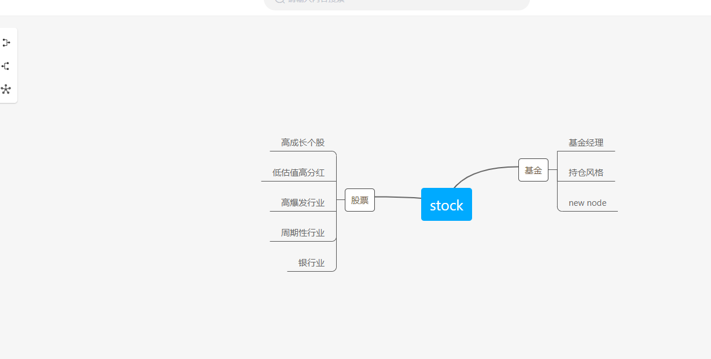
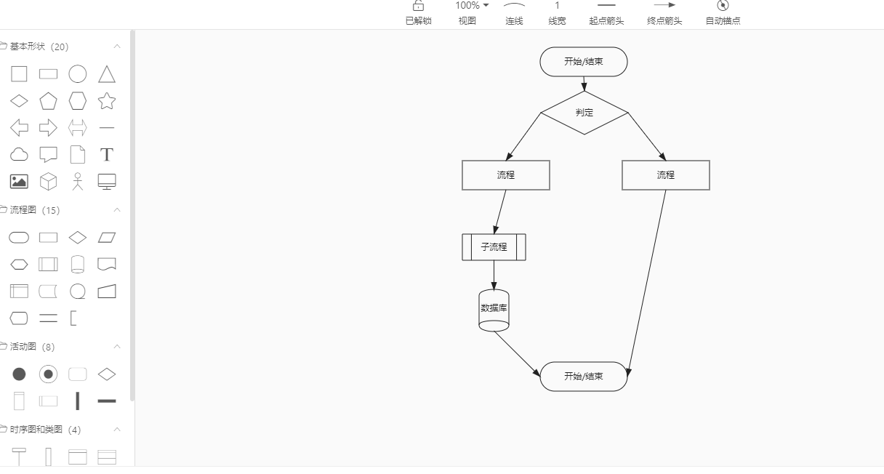
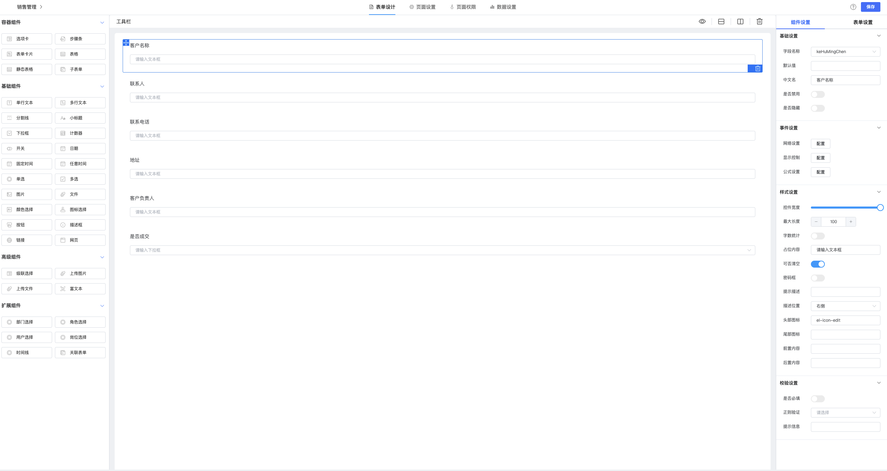
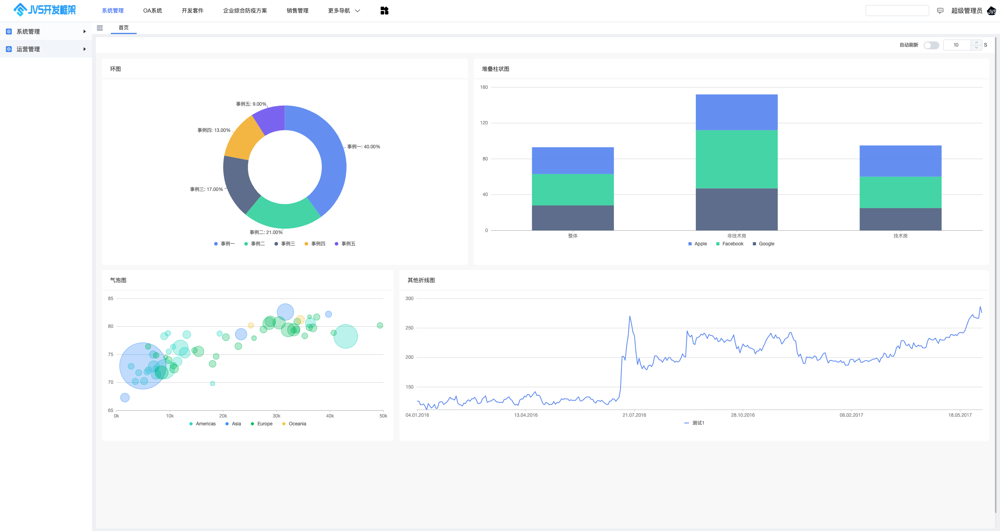

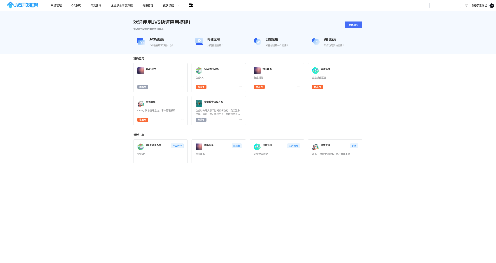
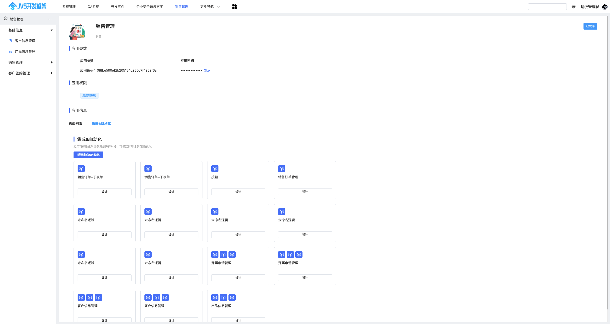
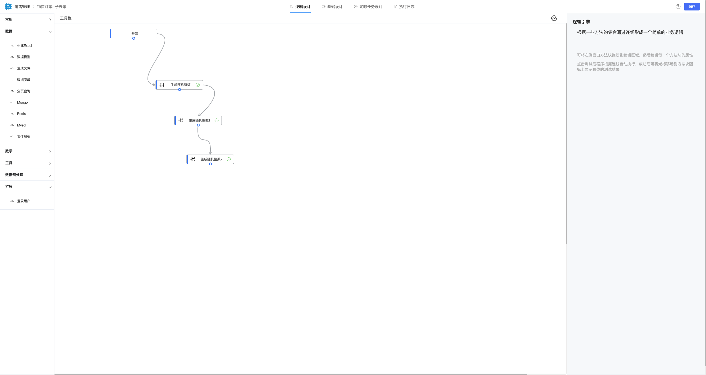

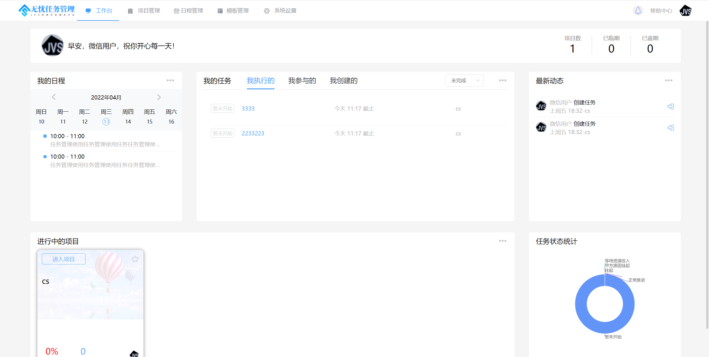
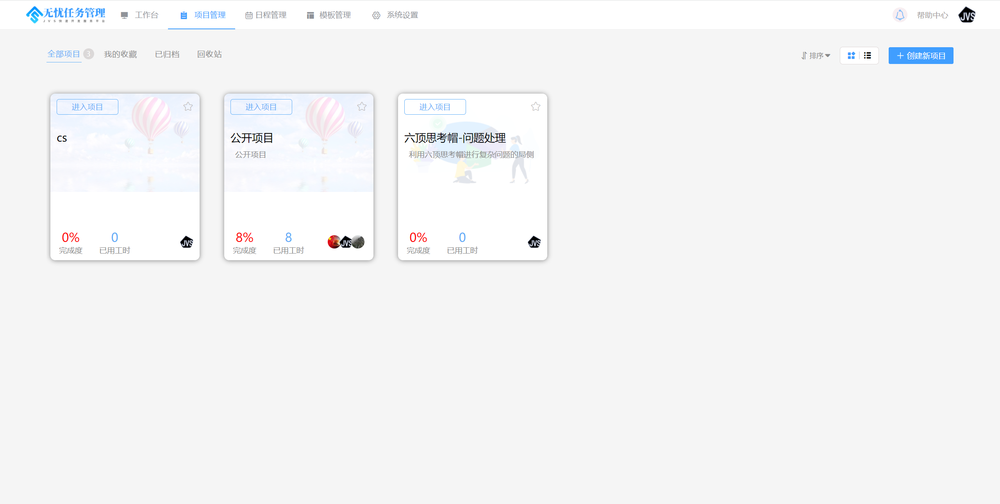
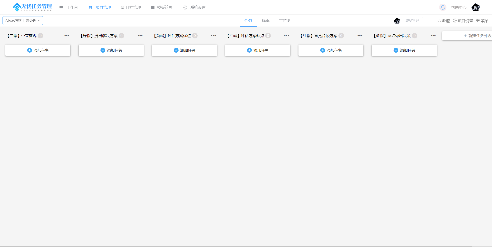
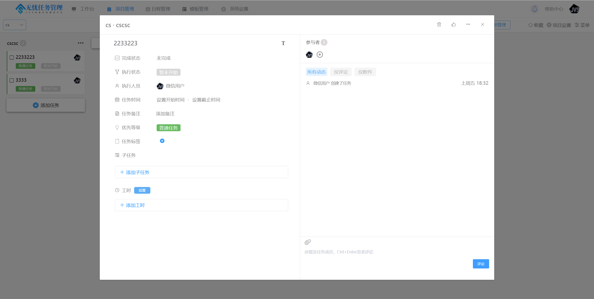
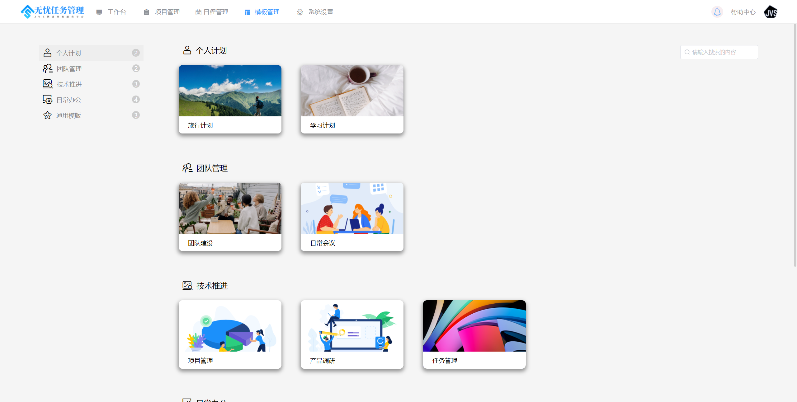
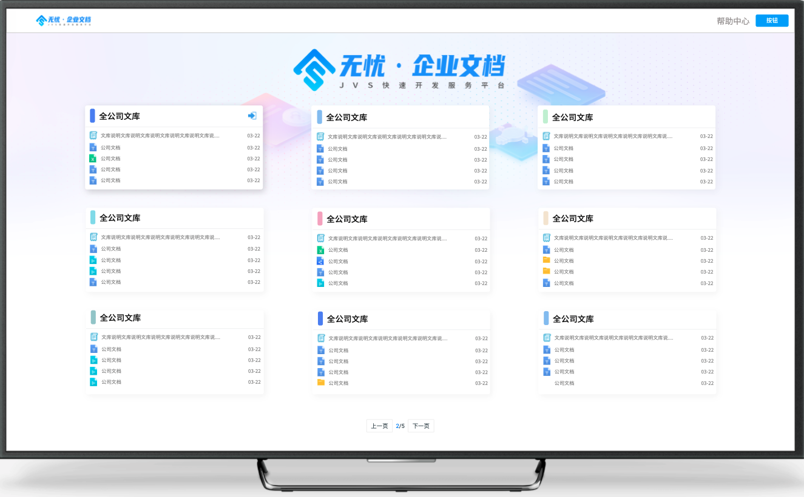


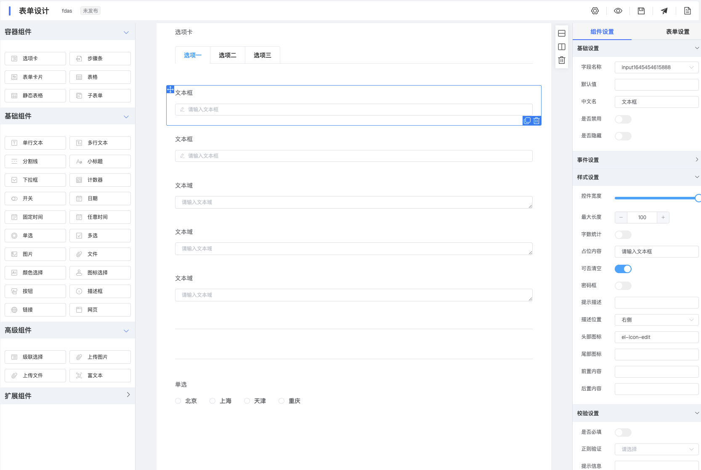
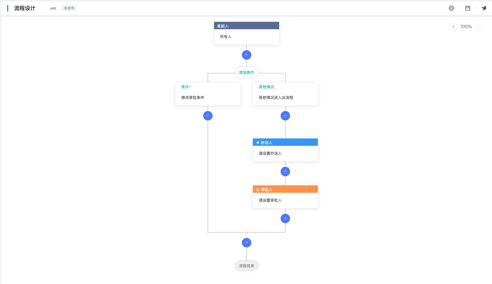
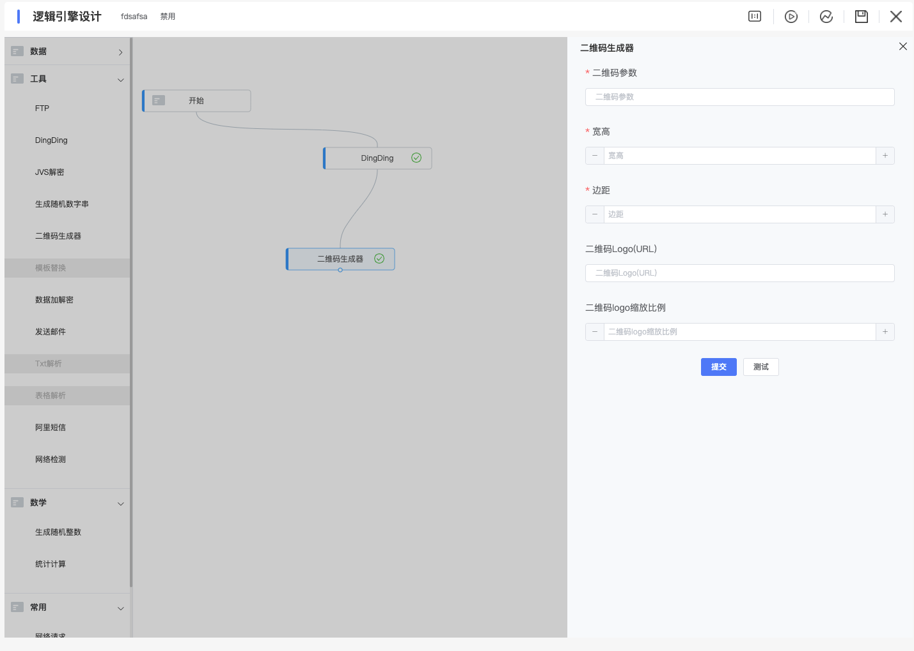

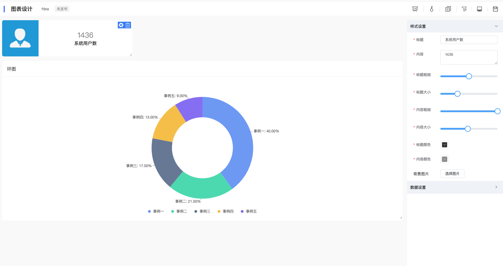


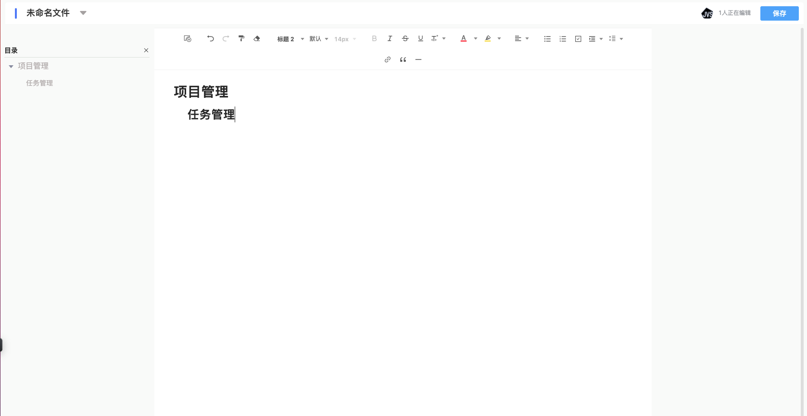


